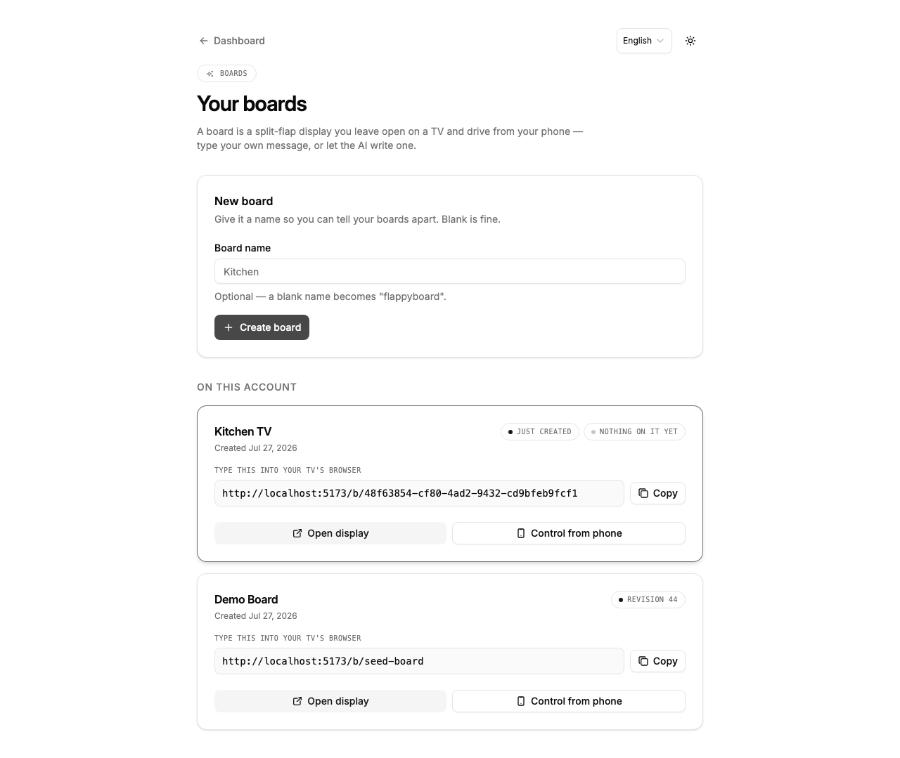

<h1 align="center">flappyboard</h1>

<p align="center">
  <strong>A split-flap message board for the TV you already own — driven from your phone.</strong><br>
  Type what it says, or hold a button and let an LLM write it.
</p>

<p align="center">
  <a href="https://workers.cloudflare.com/"></a>
  <a href="https://reactrouter.com/"></a>
  <a href="https://effect.website/"></a>
  
</p>

<p align="center">
  
</p>

---

## The pitch

A [Vestaboard](https://www.vestaboard.com/) is a beautiful thing that costs about **$3,000** and hangs on one wall.

flappyboard is the same idea running on a TV you already own. You open one URL on the TV and leave it there. Everyone else scans the QR code in the corner with their phone and starts typing — no app to install, no account to create, no password to share. The board flips, clatters, and settles, and everyone in the room watches it happen.

It is the family-message-board / departures-board / passive-aggressive-roommate-note appliance, for the cost of a browser tab.

---

## How it works

### 1. The TV opens a URL and never touches it again

<p align="center">
  
</p>

Six rows, twenty-four columns, full-bleed, every cell with its own character *and* its own colour. A QR code sits in the corner. That is the whole TV-side interaction — you type the URL once with the remote and you are done forever.

### 2. Your phone scans the QR and becomes the keyboard

<p align="center">
  
  &nbsp;&nbsp;
  
</p>

**Six bare text inputs — one per row.** Type, hit send, watch the TV. That's the fast path, and it's the whole thing for most messages.

Underneath is a live preview of the actual grid, which doubles as the colouring surface: switch to **Paint** and tap cells to colour them, or set a whole row at once. Alignment is per-row — left, centre, right, or spread.

The phone that scanned the QR gets a **12-hour grant** to write to that one board. It never sees your account. You can revoke every outstanding grant from the owner's side at any time, and the QR itself is single-use — a token that's already been redeemed is refused.

### 3. Or hold the button and just talk

Hold the push-to-talk button, say *"put up tonight's dinner plan and make it sarcastic"*, let go.

The audio goes to Whisper on Workers AI, the transcript goes to `claude-sonnet-5` with the board's JSON schema attached, and the board writes itself. If the model returns something that doesn't decode, the error is fed back and it retries twice; if it still doesn't fit, a deterministic repair pass clamps it. **The board always ends up renderable** — worst case you get clipped text, never a failed request or a broken grid.

---

## The board actually travels

A real split-flap doesn't cross-fade — each tile steps *forward through the alphabet* until it reaches the letter it wants, and it clatters the whole way. So does this one.

<p align="center">
  
  <br>
  <em>Caught mid-travel. Those aren't the final letters — the tiles are genuinely passing through the drum.</em>
</p>

The numbers, from the code and confirmed by a browser walk:

| | |
|---|---|
| Time per flap | `72ms`, plus a `200ms` landing flip |
| Stagger between tiles | `14ms × (row + col)` — the ripple runs diagonally across the board |
| Worst-case full travel | `55 × 72 + 200 = 4,160ms` — a tile going all the way around the drum |
| Peak tiles in flight | 42 faces mid-`rotateX` at once, measured |

A **colour-only** change is deliberately *not* a full revolution. On a physical board, colour and glyph share one drum, so recolouring a tile without changing its letter means 57 flaps and four seconds of scrambling text the reader is already reading. flappyboard flutters five flaps and lands back on the same glyph instead. It's an honest compromise, and it's the difference between "painting a row red" costing 488ms and costing four seconds.

---

## Quick start

### Run it locally

```bash
bun install                 # also runs cf-typegen + installs git hooks
cp .dev.vars.example .dev.vars
bun run db:migrate:local
bun run db:seed             # admin/user fixtures + a demo board
bun run dev                 # http://localhost:5173
```

Sign in, go to `/boards`, create one, and open its URL in a second window — that's your "TV". The QR in the corner points at the controller.

The AI features need an `ANTHROPIC_API_KEY` in `.dev.vars`; everything else works without one.

### Deploy it to Cloudflare

```bash
bun run setup
```

One wizard: creates the D1 databases, generates a `BETTER_AUTH_SECRET`, writes `wrangler.jsonc`, runs migrations, deploys production **and** a preview environment, and wires the GitHub Actions credentials.

<p align="center">
  
  <br>
  <em>Illustrative mockup of a typical <code>bun run setup</code> run — your IDs and subdomain will differ.</em>
</p>

Then push the API key to both environments, since local files never reach Cloudflare:

```bash
wrangler secret put ANTHROPIC_API_KEY
wrangler secret put ANTHROPIC_API_KEY --env preview
```

---

## Managing boards

<p align="center">
  
</p>

One account, many boards — kitchen, office, the one you point at your flatmate. Each card hands you the URL to type into that TV's browser, a copy button, and direct links to the display and the controller.

Deleting a board cascades its snapshot history with it, and every grant that pointed at it stops working in the same instant — a grant is verified against the board row, so once the row is gone there is nothing left to verify against.

---

## How it's built

- **The compiler owns the 6×24 invariant.** Writers — phone, socket, model — produce a loose `BoardMessage`; `compileMessage` is the only bridge to a strict `BoardGrid`. It folds the charset, word-wraps to 24, applies alignment, and pads to exactly 144 cells, so no caller can construct an invalid board.
- **One Durable Object per board is the only live writer.** The Worker validates, compiles, and hands the grid to `BoardRoom`, which fans it out over WebSocket Hibernation (an idle board costs nothing) and snapshots to D1. A read that can't reach the DO falls back to the last snapshot.
- **Pairing is one HMAC primitive.** Signed message is `prefix|boardId.length|boardId|grantEpoch|payload` — the prefix authenticates purpose, the board id is a MAC audience, length framing keeps the encoding injective, and bumping the grant epoch revokes every outstanding grant instantly. Single-use is an atomic check-and-set inside `blockConcurrencyWhile`.
- **An unowned board is a 404, never a 403** — a `FORBIDDEN` would confirm the id is real and make boards enumerable.

---

## Stack

| Layer | Choice |
|---|---|
| Runtime | Cloudflare Workers — same runtime local and deployed, no Node |
| Framework | React Router v7 (SSR) |
| Realtime | Durable Objects + WebSocket Hibernation, one DO per board |
| API | tRPC v11, every procedure wrapped in Effect TS |
| Data | D1 (SQLite) via Drizzle ORM |
| Auth | Better Auth with the Drizzle adapter + admin plugin |
| Validation | Effect Schema — no Zod, anywhere |
| Errors | `Data.TaggedError`, mapped to tRPC codes by `tagToTRPC` |
| AI | `claude-sonnet-5` (structured output) + Whisper on Workers AI |
| UI | ShadCN/Radix + Tailwind v4 |
| Tests | Vitest 3 + `@effect/vitest`, Playwright for smoke + verification walks |

Built on [cf-saas-starter-react-router](https://github.com/SeanningTatum/cf-saas-starter-react-router).

---

## Verification

`typecheck` 0 · **849 tests across 44 files** · `build` 0 · `harness-check` 7/7 · e2e smoke green.

Beyond the unit suite, user-visible flows get a **browser walk**: a headless run against the live app that drives the golden path plus an error path, screenshots every step, and writes a verdict doc to `.brain/features/<slug>/verifications/`. Every screenshot in this README came out of one of those runs.

---

## Status

**MVP.** Everything above works and is verified. Known gaps, honestly:

- 🔴 **[Issue #1](https://github.com/SeanningTatum/flappyboard/issues/1) — no rate limiting on the two paid endpoints.** `board.generate` and `/api/transcribe` both cost money per call and are reachable by anyone holding a 12-hour grant. **Do not deploy with a real API key until this lands.**
- The voice path hasn't been driven on a real phone yet — `mediaDevices` needs a secure context, so that's an HTTPS-deploy test.
- The display hasn't been walked on the actual living-room TV, only at TV resolution in a headless browser.
- Two sound packs ship (`classic`, `soft`), switchable from the phone. The registry takes more.

---

## Working in this repo

This repo runs an **agent harness** — a `.brain/` directory of retrieval-first docs, deterministic slash-command gates, and machine-checkable state, so that Claude Code / Cursor / Codex stay coherent across sessions instead of re-deriving conventions every time.

**If you are a human:** read [`AGENTS.md`](AGENTS.md) once. It points at everything else.

**If you are an agent:** read [`AGENTS.md`](AGENTS.md) *first*, then use the `brain` CLI rather than reading `.brain/` files by hand.

```bash
brain                     # dashboard — features, what's in progress, last checkpoint
brain progress            # rolling session cursor
brain docs <section>      # rules / recipes / architecture / codebase
brain search "<query>"    # find anything in the brain
brain check               # brain-state invariants
```

Non-trivial work is bookended by `/start-task` and `/verify-done`. Five non-negotiables are enforced by grep and by the `effect-ts-enforcer` sub-agent: Effect TS by default, Effect Schema (no Zod), tagged errors mapped in `tagToTRPC`, a unit test for every helper and repository, and Workers bindings via the `CloudflareEnv` tag (never `process.env`).

---

## Commands

```bash
bun run dev                 # dev server, auto-migrates local D1 → localhost:5173
bun run build               # production build
bun run deploy              # build + deploy to Cloudflare
bun run deploy:preview      # deploy the -preview worker
bun run typecheck           # cf-typegen + react-router typegen + tsc -b
bun run test                # Vitest unit suite
bun run test:e2e            # Playwright smoke
bun run db:generate         # generate a Drizzle migration
bun run db:migrate:local    # apply migrations to local D1
bun run db:seed             # seed fixtures + a demo board
bun run db:studio           # Drizzle Studio
bun run sfx:generate        # regenerate the flap sound pack
./scripts/harness-check.sh  # brain invariants + repo supplement
```

---

## Layout

```
app/
├── components/board/   FlapTile, BoardGridView, QrOverlay, PushToTalkButton
├── lib/board/          compile.ts (the 6×24 compiler), repair.ts, flap-travel.ts,
│                       pairing.ts (the HMAC primitive), sfx.ts
├── lib/schemas/        Effect Schema — BoardMessage, BoardGrid, palette, charset
├── routes/board/       display.tsx (the TV), control.tsx (the phone)
├── routes/boards/      board management
├── repositories/       Drizzle-backed Effect.Service repos
├── services/           board-agent.ts (LLM), transcription.ts (Whisper), board-room.ts
├── trpc/routes/        board.ts — get, setMessage, generate, history, pairing
└── models/errors/      tagged errors

workers/
└── board-room.ts       the BoardRoom Durable Object — grid, WS fanout, hibernation

.brain/                 the agent harness (see AGENTS.md)
```
