<h1 align="center">flappyboard</h1>

<p align="center">
  <strong>A split-flap message board for the TV you already own — driven from your phone.</strong><br>
  Type what it says, or hold a button and let an LLM write it.
</p>

<p align="center">
  <a href="https://workers.cloudflare.com/"></a>
  <a href="https://reactrouter.com/"></a>
  <a href="https://effect.website/"></a>
  
</p>

<p align="center">
  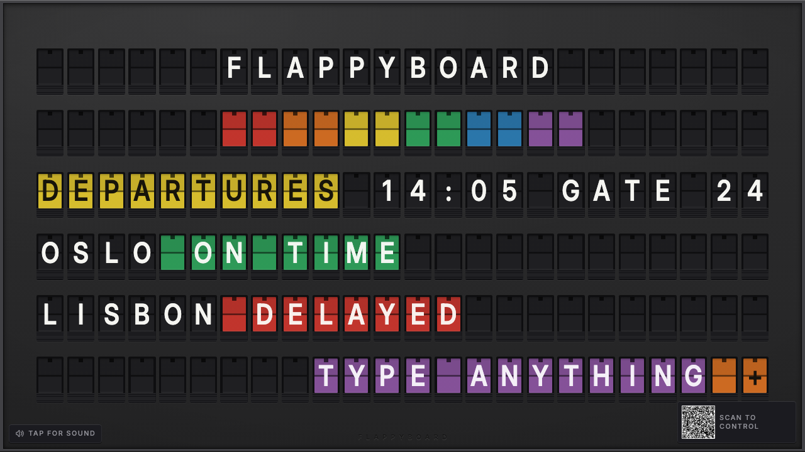
</p>

---

## The pitch

A [Vestaboard](https://www.vestaboard.com/) is a beautiful thing that costs about **$3,000** and hangs on one wall.

flappyboard is the same idea running on a TV you already own. You open one URL on the TV and leave it there. Everyone else scans the QR code in the corner with their phone and starts typing — no app to install, no account to create, no password to share. The board flips, clatters, and settles, and everyone in the room watches it happen.

It is the family-message-board / departures-board / passive-aggressive-roommate-note appliance, for the cost of a browser tab.

---

## How it works

### 1. Point a TV at `/tv`. It shows a code.

<p align="center">
  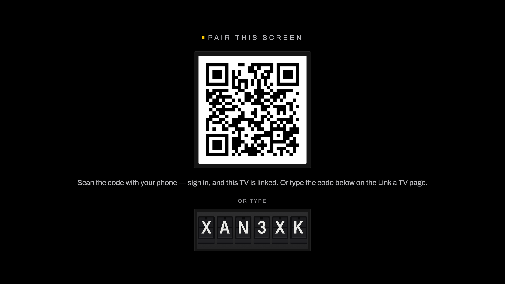
</p>

This is the one instruction the product cannot infer for you: **on your TV's browser, go to `yourhost/tv`.** Type it once with the remote and never touch that TV again.

The code underneath the QR is not a mono readout of a code — it is six **real flap tiles**, the same component that draws the board. The split-flap module is the product's atomic UI primitive, so it shows up wherever a short string matters, at whatever scale that surface needs.

### 2. Scan it with your phone. That's the whole setup.

<p align="center">
  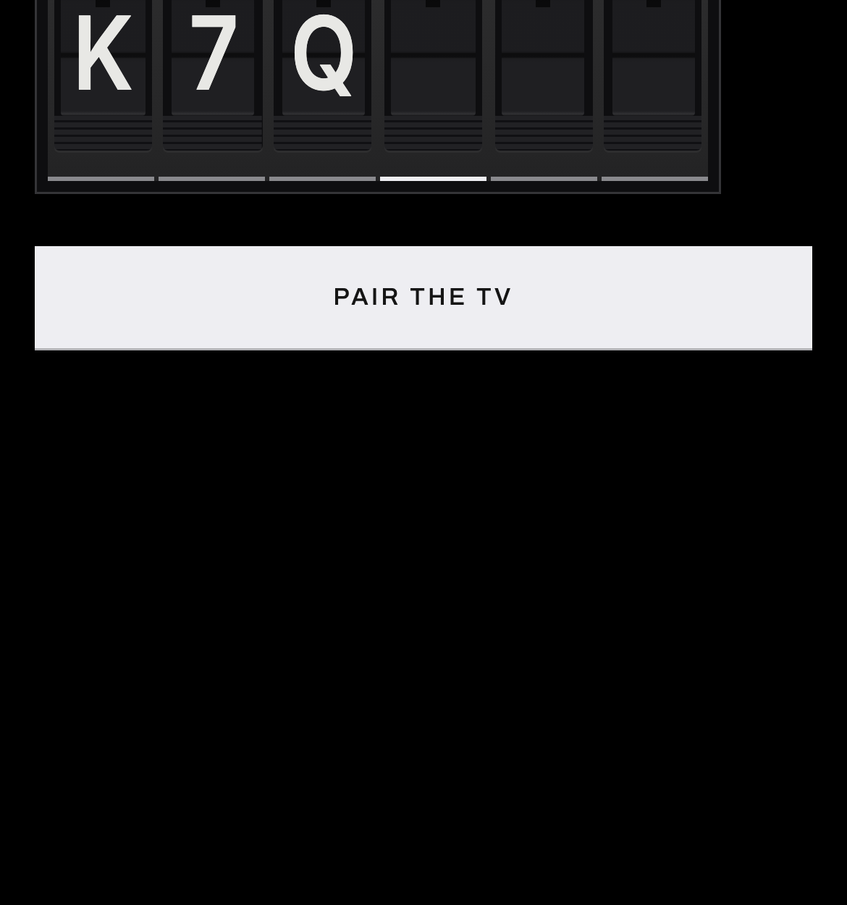
</p>

Scan, sign in, done — you land on the controller for that TV, with nothing to answer. **A board *is* a TV**, so scanning always makes one and names it for you. There is no "create a board" step, no picker, and no board-count branch anywhere in the flow.

If the phone can't scan (or the QR has expired), the same page takes the code by hand — and the field is the flap tiles themselves.

### 3. The TV becomes the board

<p align="center">
  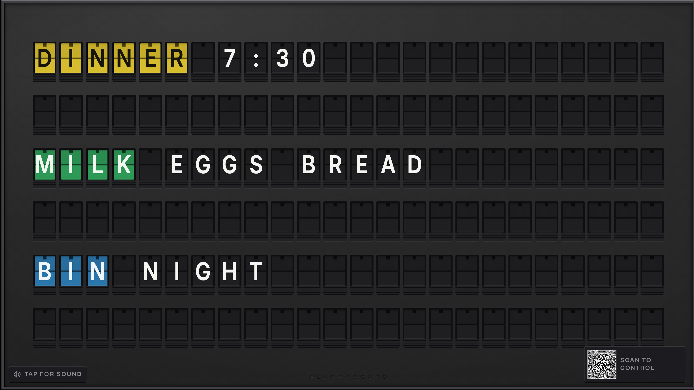
</p>

Six rows, twenty-four columns, full-bleed, every cell with its own character *and* its own colour. A QR code sits in the corner so anyone else in the room can join by pointing a camera at it.

### 4. The phone is the controller

<p align="center">
  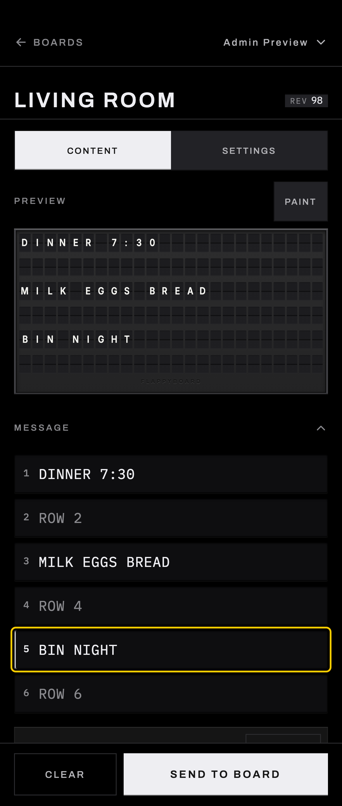
  &nbsp;&nbsp;
  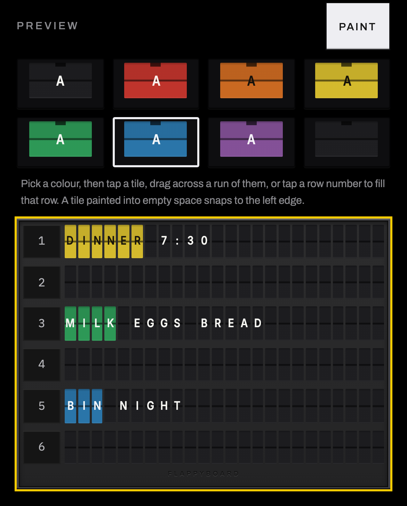
</p>

**The board itself is the instrument.** One rectangle sits at the top: when nothing is composed it shows the live board off the socket, and the moment you type it becomes the draft. Six numbered wells sit under it, one per row — type, hit send, watch the TV.

That same rectangle is the colouring surface: switch to **Paint**, pick one of the eight pigments, and tap cells or drag across a run. Alignment is per-row — left, centre, right, or spread.

**Settings** is the second tab, on the same screen: the TV's address, paired devices with a count, rename, un-pair, delete. Destructive actions arm in place rather than opening a dialog — the key swaps to a consequence sentence and a confirm, in the same slot your thumb is already on.

<p align="center">
  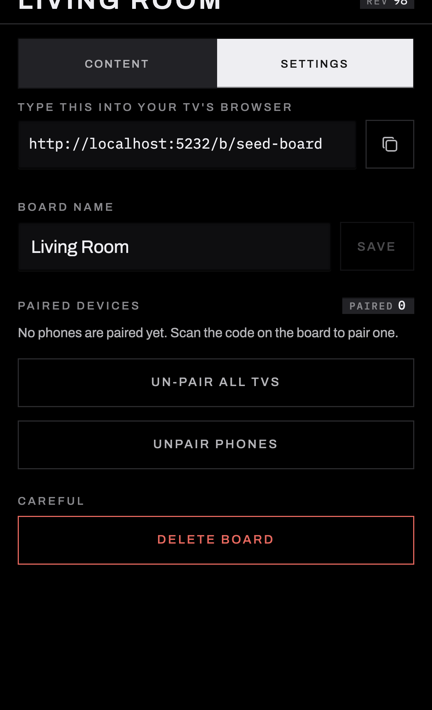
</p>

The phone that scanned the QR gets a **12-hour grant** to write to that one board. It never sees your account. You can revoke every outstanding grant from the owner's side at any time, and the QR itself is single-use — a token that's already been redeemed is refused.

### 5. Or hold the button and just talk

Hold the push-to-talk button, say *"put up tonight's dinner plan and make it sarcastic"*, let go.

The audio goes to Whisper on Workers AI, the transcript goes to `claude-sonnet-5` with the board's JSON schema attached, and the board writes itself. If the model returns something that doesn't decode, the error is fed back and it retries twice; if it still doesn't fit, a deterministic repair pass clamps it. **The board always ends up renderable** — worst case you get clipped text, never a failed request or a broken grid.

---

## The board actually travels

A real split-flap doesn't cross-fade — each tile steps *forward through the alphabet* until it reaches the letter it wants, and it clatters the whole way. So does this one.

<p align="center">
  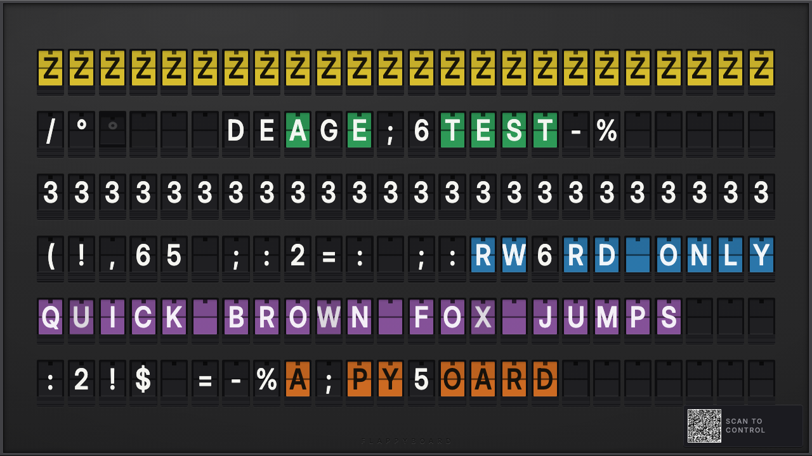
  <br>
  <em>Caught mid-travel. Those aren't the final letters — the tiles are genuinely passing through the drum.</em>
</p>

The numbers, from the code and confirmed by a browser walk:

| | |
|---|---|
| Time per flap | `72ms`, plus a `200ms` landing flip |
| Stagger between tiles | `14ms × (row + col)` — the ripple runs diagonally across the board |
| Worst-case full travel | `55 × 72 + 200 = 4,160ms` — a tile going all the way around the drum |
| Peak tiles in flight | 42 faces mid-`rotateX` at once, measured |

A **colour-only** change is deliberately *not* a full revolution. On a physical board, colour and glyph share one drum, so recolouring a tile without changing its letter means 57 flaps and four seconds of scrambling text the reader is already reading. flappyboard flutters five flaps and lands back on the same glyph instead. It's an honest compromise, and it's the difference between "painting a row red" costing 488ms and costing four seconds.

---

## Quick start

### Run it locally

```bash
bun install                 # also runs cf-typegen + installs git hooks
cp .dev.vars.example .dev.vars
bun run db:migrate:local
bun run db:seed             # admin/user fixtures + a demo board
bun run dev                 # http://localhost:5173
```

Open `http://localhost:5173/tv` in a second window — that's your "TV". Scan the QR with your phone, or type the code it shows into `/link` in a third window. Either way you land on the controller with a board already made.

The AI features need an `ANTHROPIC_API_KEY` in `.dev.vars`; everything else works without one.

### Deploy it to Cloudflare

```bash
bun run setup
```

One wizard: creates the D1 databases, generates a `BETTER_AUTH_SECRET`, writes `wrangler.jsonc`, runs migrations, deploys production **and** a preview environment, and wires the GitHub Actions credentials.

<p align="center">
  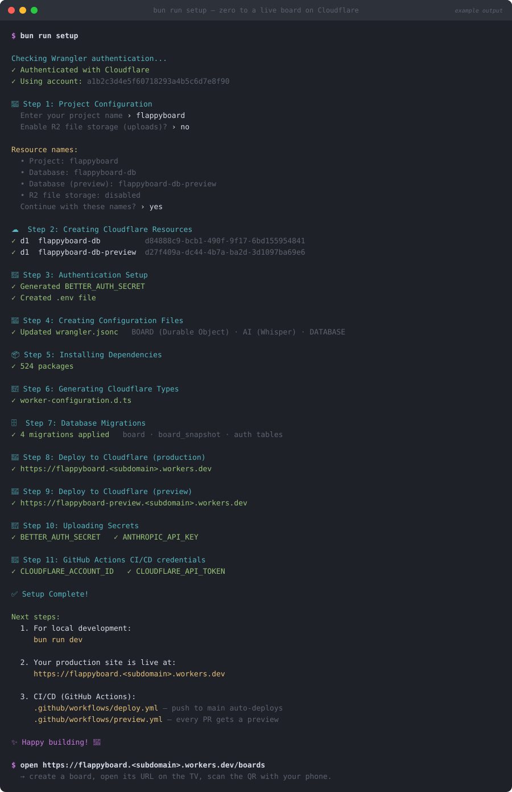
  <br>
  <em>Illustrative mockup of a typical <code>bun run setup</code> run — your IDs and subdomain will differ.</em>
</p>

Then push the API key to both environments, since local files never reach Cloudflare:

```bash
wrangler secret put ANTHROPIC_API_KEY
wrangler secret put ANTHROPIC_API_KEY --env preview
```

---

## More than one TV

<p align="center">
  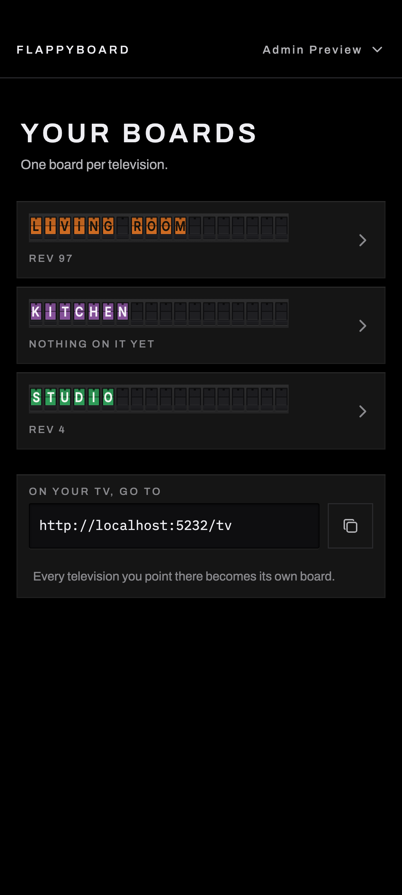
</p>

One account, many TVs — kitchen, office, the one you point at your flatmate. The rack is a **switcher, not a destination**: each board wears its own name in real flaps, in a pigment derived from its id, so you recognise the row you want by colour before you've read it. Everything you can *do* to a board lives on that board's controller, not here.

Adding another TV is one action with nothing to answer: open `/tv` on it and scan.

Deleting a board cascades its snapshot history with it, and every grant that pointed at it stops working in the same instant — a grant is verified against the board row, so once the row is gone there is nothing left to verify against.

---

## The front door drives the board

<p align="center">
  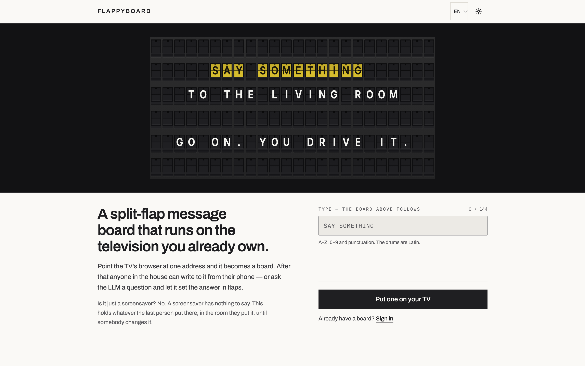
</p>

The landing page is a controller. The field under the board is real — type in it and the actual 144-tile animator flips, before there is an account, a socket or a server round trip.

That is deliberate, and it is the one claim this product can make that a real Vestaboard cannot: they can't let a stranger drive a $3,000 mechanical object from their homepage. Ours are software.

<p align="center">
  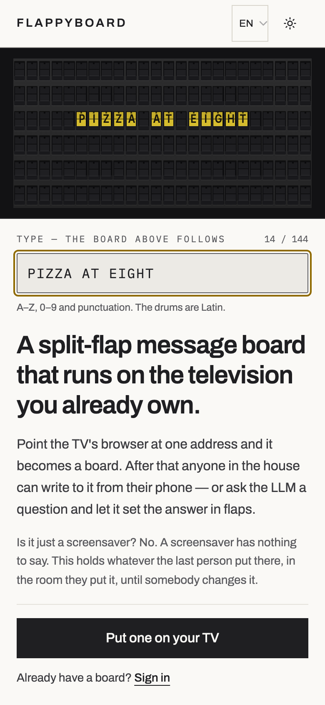
</p>

Everything typed goes through `compileMessage` — the same 6×24 compiler the television runs — so the landing page can't become a second, quietly diverging board. Type Chinese and the board **holds** what it last showed rather than blanking, and says why: the drums are Latin, because a real split-flap shows the same letters wherever it is sold.

---

## Design

Two design systems used to live here and only one of them was any good: stock shadcn neutral on the app, and a researched physical language on the board — a tonal ladder, hairlines instead of blurs, 1px lips instead of shadows, and eight pigments measured off a real Vestaboard with PIL. The second one was hardcoded hex that nothing outside the board could reach.

Now there is one system. The board's language is the token contract, extended app-wide, with a `[data-surface="hardware"]` scope for the console surfaces. Archivo and IBM Plex Mono are self-hosted. Radius is 2px everywhere, because the object is. Amber `#ffcc00` is `--signal` — a state colour, never an action surface, so no CTA is ever amber.

**The split-flap module is the atomic UI primitive, not a picture of one.** It sets the pairing code on the TV, the code field on `/link`, board names on the rack and the headline on the landing page — one idea carried structurally at four scales.

Design work passes two gates that the usual ones cannot replace. `bun run design:audit` measures the render — contrast, overflow, target size, reduced motion, accent economy. Then a `design-critic` sub-agent judges the *pixels* against an anti-slop checklist and never reads the source; a P0 or P1 from it is blocking. It has returned **DO NOT SHIP** four times on this repo, and every time it caught something all the mechanical gates passed happily: a code field measuring 1.15:1 because it holds no text at rest, colour swatches 31px tall that no keyboard walk reaches, a mute switch whose `aria-checked` was correct while its semantics were inverted.

---

## How it's built

- **The compiler owns the 6×24 invariant.** Writers — phone, socket, model — produce a loose `BoardMessage`; `compileMessage` is the only bridge to a strict `BoardGrid`. It folds the charset, word-wraps to 24, applies alignment, and pads to exactly 144 cells, so no caller can construct an invalid board.
- **One Durable Object per board is the only live writer.** The Worker validates, compiles, and hands the grid to `BoardRoom`, which fans it out over WebSocket Hibernation (an idle board costs nothing) and snapshots to D1. A read that can't reach the DO falls back to the last snapshot.
- **Pairing is one HMAC primitive.** Signed message is `prefix|boardId.length|boardId|grantEpoch|payload` — the prefix authenticates purpose, the board id is a MAC audience, length framing keeps the encoding injective, and bumping the grant epoch revokes every outstanding grant instantly. Single-use is an atomic check-and-set inside `blockConcurrencyWhile`.
- **An unowned board is a 404, never a 403** — a `FORBIDDEN` would confirm the id is real and make boards enumerable.

---

## Stack

| Layer | Choice |
|---|---|
| Runtime | Cloudflare Workers — same runtime local and deployed, no Node |
| Framework | React Router v7 (SSR) |
| Realtime | Durable Objects + WebSocket Hibernation, one DO per board |
| API | tRPC v11, every procedure wrapped in Effect TS |
| Data | D1 (SQLite) via Drizzle ORM |
| Auth | Better Auth with the Drizzle adapter + admin plugin |
| Validation | Effect Schema — no Zod, anywhere |
| Errors | `Data.TaggedError`, mapped to tRPC codes by `tagToTRPC` |
| AI | `claude-sonnet-5` (structured output) + Whisper on Workers AI |
| UI | ShadCN/Radix + Tailwind v4 |
| Tests | Vitest 3 + `@effect/vitest`, Playwright for smoke + verification walks |

Built on [cf-saas-starter-react-router](https://github.com/SeanningTatum/cf-saas-starter-react-router).

---

## Verification

`typecheck` 0 · **1,314 tests across 59 files** · `build` 0 · `harness-check` 10/10 · e2e smoke green.

Beyond the unit suite, user-visible flows get a **browser walk**: a headless run against the live app that drives the golden path plus an error path, screenshots every step, and writes a verdict doc to `.brain/features/<slug>/verifications/`. Every screenshot in this README came out of one of those runs.

---

## Status

**MVP, redesigned.** Everything above works and is verified. Known gaps, honestly:

- 🟡 **The display has never been walked on a real living-room TV** — only at TV resolution in a headless browser. This is the one owed check that matters most: the pairing code is meant to be read across a room, and the panel a 2017 Samsung ships is Chromium 56, so the flap sizing deliberately avoids `aspect-ratio` on reasoning from a documented constraint rather than a measurement on the glass.
- The voice path hasn't been driven on a real phone yet — `mediaDevices` needs a secure context, so that's an HTTPS-deploy test.
- Desktop composition is deferred by choice. The phone is the controller, so every surface is built phone-first; at 1440 the console is a narrow column in a lot of black.
- Two sound packs ship (`classic`, `soft`), switchable from the phone. The registry takes more.

[Issue #1](https://github.com/SeanningTatum/flappyboard/issues/1) — no rate limiting on the two endpoints that spend money — is **closed**. Both `board.generate` and `/api/transcribe` are bounded now.

---

## Working in this repo

This repo runs an **agent harness** — a `.brain/` directory of retrieval-first docs, deterministic slash-command gates, and machine-checkable state, so that Claude Code / Cursor / Codex stay coherent across sessions instead of re-deriving conventions every time.

**If you are a human:** read [`AGENTS.md`](AGENTS.md) once. It points at everything else.

**If you are an agent:** read [`AGENTS.md`](AGENTS.md) *first*, then use the `brain` CLI rather than reading `.brain/` files by hand.

```bash
brain                     # dashboard — features, what's in progress, last checkpoint
brain progress            # rolling session cursor
brain docs <section>      # rules / recipes / architecture / codebase
brain search "<query>"    # find anything in the brain
brain check               # brain-state invariants
```

Non-trivial work is bookended by `/start-task` and `/verify-done`. Five non-negotiables are enforced by grep and by the `effect-ts-enforcer` sub-agent: Effect TS by default, Effect Schema (no Zod), tagged errors mapped in `tagToTRPC`, a unit test for every helper and repository, and Workers bindings via the `CloudflareEnv` tag (never `process.env`).

---

## Commands

```bash
bun run dev                 # dev server, auto-migrates local D1 → localhost:5173
bun run build               # production build
bun run deploy              # build + deploy to Cloudflare
bun run deploy:preview      # deploy the -preview worker
bun run typecheck           # cf-typegen + react-router typegen + tsc -b
bun run test                # Vitest unit suite
bun run test:e2e            # Playwright smoke
bun run db:generate         # generate a Drizzle migration
bun run db:migrate:local    # apply migrations to local D1
bun run db:seed             # seed fixtures + a demo board
bun run db:studio           # Drizzle Studio
bun run sfx:generate        # regenerate the flap sound pack
./scripts/harness-check.sh  # brain invariants + repo supplement
```

---

## Layout

```
app/
├── components/board/   FlapTile, BoardGridView, QrOverlay, PushToTalkButton,
│                       FlapWord (a short string in real flaps), console.tsx
│                       (the hardware surface kit), ConsoleShell, ControllerSettings
├── lib/board/          compile.ts (the 6×24 compiler), repair.ts, flap-travel.ts,
│                       pairing.ts (the HMAC primitive), sfx.ts
├── lib/schemas/        Effect Schema — BoardMessage, BoardGrid, palette, charset
├── routes/board/       display.tsx (the TV), control.tsx (the phone — two tabs),
│                       hardware-theme.css (the [data-surface="hardware"] scope)
├── routes/boards/      the rack — a switcher, not a manager
├── routes/tv.tsx       the pairing screen a television shows
├── routes/link.tsx     scan or type a code; no UI at all on the happy path
├── repositories/       Drizzle-backed Effect.Service repos
├── services/           board-agent.ts (LLM), transcription.ts (Whisper), board-room.ts
├── trpc/routes/        board.ts — get, setMessage, generate, history, pairing
└── models/errors/      tagged errors

workers/
└── board-room.ts       the BoardRoom Durable Object — grid, WS fanout, hibernation

.brain/                 the agent harness (see AGENTS.md)
```
